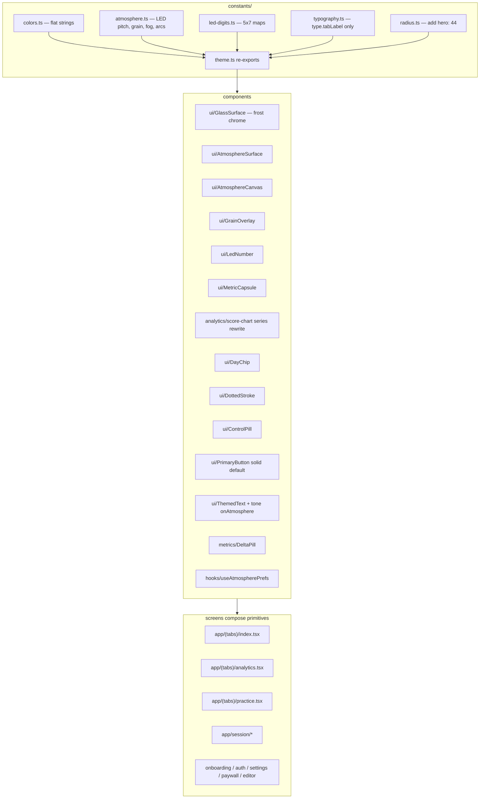
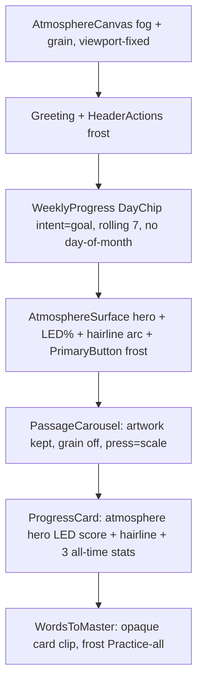
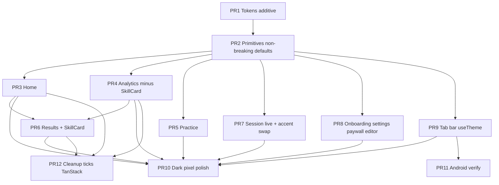

# Clarity Visual Language Redesign: Atmospheric Glass Dashboard
Status: layout and LED-numeral decisions in this draft are superseded by `docs/layout-structure-plan.md`. Color tokens in this file are unchanged.

| Field | Value |
| --- | --- |
| **Title** | Atmospheric Glass — a visual-language overhaul of Clarity |
| **Author** | Clarity design |
| **Date** | 2026-09-06 |
| **Status** | Draft (rev 4) |
| **Scope** | Look, material, color, type treatment of numbers, card shapes, data-viz, surface language. No functional, IA, scoring, or backend change. |
| **App** | Expo SDK 57 React Native speech-practice app (`clarity-main`) |

---

## Overview

Clarity today is a competent iOS 26 liquid-glass product: cool gray canvas (`#F4F4F6` / `#0B0B0D`), frosted `GlassSurface` cards, SF Pro Rounded, inverted near-black capsules, and a signature **tick-meter** language (daily-goal fan, results ring, skill tick-bars, dashed weekly rings). It reads as system chrome. The three reference photographs in `destination/` describe a different product feeling — **Atmospheric Glass** (Fog Dashboard): a pale cool canvas, chromatic fog behind superellipse cards, film grain, mesh-gradient metric capsules, dotted charts with a glass cursor, and **dot-matrix LED numerals** for measured values.

This document specifies how every existing functional block restyles onto that language without changing routes, stores, scoring, Convex, Clerk, speech, or copy. An engineer should not invent hex values, glyph maps, CSS strings, or API shapes — they are all below. Screens keep importing components; components keep importing tokens. Hex, `fontSize`, and raw radii remain illegal at call sites.

---

## Background & Motivation

### Current visual identity (verified against code)

The design system is centralized and deliberately austere:

- **Entry point.** `constants/theme.ts` re-exports `colors`, `fonts`, `radius`, `spacing`, `type`, `motion`, `springs`. Comment at lines 14–17: *“There is deliberately no `shadows` token set: the app's depth comes from liquid glass, and it uses no shadows anywhere.”*
- **Canvas.** `constants/colors.ts`: light `background: '#F4F4F6'`, dark `'#0B0B0D'`. Cool, almost-neutral, slightly blue. Navigation paints this via `NavThemeProvider` in `app/_layout.tsx` (`SystemUI.setBackgroundColorAsync(colors.background)`).
- **Frost.** `components/ui/glass-surface.tsx` wraps `expo-glass-effect` `GlassView` with `glassTint` `rgba(255,255,255,0.45)` / `rgba(10,10,12,0.55)`, fallback `glassFallback` near-opaque white/charcoal. Radius `lg=28` compact, `xl=36` hero, `full=9999` pills. `borderCurve: 'continuous'`. Nested `GlassView` does not render on iOS 26 — cards that hold a glass child (`DailyGoalCard`, `FreestyleCard`, `PrimaryButton` inside a card) render `GlassSurface` as an **absolute sibling**.
- **Type.** SF Pro Rounded, loaded at runtime in `app/_layout.tsx` via `useFonts(fontAssets)` because Expo Go cannot embed fonts at build time; `app.json` expo-font plugin covers dev builds. Ramp in `constants/typography.ts`: `largeTitle` 34, `title` 22, `headline` 17, `footnote` 13, `displayValue` 26 heavy. Weight from `fontFamily` (`constants/fonts.ts`), never `fontWeight`. Ink through `<ThemedText variant=… tone=… />`.
- **Accent.** System blue `#3478F6` (`colors.accent`). Used for live teleprompter highlight (`components/session/teleprompter.tsx` + `LiveWpm`), marketing, selected onboarding checks. **Scores are never colored by quality** — encoded in `constants/metrics.ts` lines 77–85 and in `DeltaLabel` / `CounterCard` comments. Only deltas (positive green), FOCUS pill (amber), danger (account), warn (live drift / unclear words).
- **Primary CTA.** `PrimaryButton`: inverted capsule, `inverseSurface` `#1C1C21` / near-white, heights 54/60, optional Hugeicon. Own `GlassView` with `tintColor`. There is no `variant` prop today. Pressed state is `opacity: 0.85` on the `Pressable` that **wraps** `GlassView` (`styles.pressed`).
- **Chrome.** Floating liquid-glass tab pill (`components/glass-tabs/glass-tab-bar.tsx`): Home / Practice / Analytics, 58pt expanded / 44pt minimized, Revolut-style minimize-on-scroll. Progressive blur at status bar and tab bar. Header: `largeTitle` left, streak fire capsule + settings cog right (`HeaderActions`).
- **Data viz.** Tick meters are the signature. `DailyGoalCard` is a 15-tick **bottom-half radial fan**. `ScoreGauge` is a 20-tick 270° ring via `TickGauge`. `TickBar` default is **36** ticks (`tick-bar.tsx`); `ProgressCard` overrides to **35** (`TICK_COUNT = 35`). `WeeklyProgress` uses dashed/solid SVG rings around day letters **and** a day-of-month under each letter. Analytics `ScoreChart` is TanStack Charts vertical bars + dashed average line, with horizontal-scrub at `score-chart.tsx` lines 273–330 that reports the full `ScoreChartPoint` into the card header.
- **Passage cards.** The one inverted surface: dark in both schemes (`CARD_TINT` in `passage-carousel.tsx` 49–53), CSS-like `experimental_backgroundImage` base+blob gradients from `constants/passages.ts`, white `onArtwork` text, glass “Start” pill. Opal-style 2-up carousel with 15% peek. Constraint, documented at `passage-carousel.tsx` 200–221: **one gradient per view** (multi-background strings are not supported) and RN’s parser mis-eats `at` after a single-size `circle Npx` — both radii must be spelled out (`ellipse Wpx Hpx at …`).
- **Motion.** Reanimated springs `snap` / `settle` / `glide`. `IntroReveal` stagger. Glass cannot animate opacity (breaks blur) — transform only. Daily-goal sweep 900ms celebratory.
- **Density.** Airy card-stack. `SectionHeader` (`section-header.tsx` 14–28) is `ThemedText variant="title"` (**22pt**) with `marginTop: spacing.xxxl` (**32pt of margin**, not type). Screen padding on Home/Analytics/Practice is `spacing.xl` (20). `constants/spacing.ts` line 10 still comments “Screen edge padding is `spacing.lg`” (16) — a pre-existing inconsistency; tab screens use `xl`. Gaps `spacing.md` (12). No drop shadows.
- **WeeklyProgress data.** Home already passes `stats.weeklyHistory` (`app/(tabs)/index.tsx`). The `DEFAULT_HISTORY` comment in `weekly-progress.tsx` (“until real session data exists”) is stale.

Current marketing frames (`assets/marketing/screenshots/screen-01.jpg`–`screen-05.jpg`) confirm this language: blue spoken-word highlight, tick-ring 76/100, gray bar chart, inverted black Natural chip, floating gray glass tab bar.

`package.json` has `expo-blur`, `expo-glass-effect`, `react-native-svg`, `@tanstack/charts`. No Skia. No `expo-linear-gradient`. Fonts load via `useFonts(fontAssets)` in `app/_layout.tsx` (~line 253); `app.json` expo-font plugin lists the five OTFs.

### Pain versus destination

The destination photographs (`destination/SnapInsta.to_*.jpg`) are **theme references**, not a product to clone:

1. **Full composition** — pale cool canvas; a large soft vertical fog/ink-wash figure (dark silhouette, cyan-blue chromatic bleed, film grain) behind floating cards. Hero squircle “Flasks Per Day”: navy→teal→cyan atmospheric fill, hairline gaussian curve, circular glass lens at the peak, dotted grid, circular day pills S–S with selected day filled white, ghost date-range stepper. Below: 2×2 metric capsules (pink mesh + LED 16.2, blue mesh + LED 2.8 + sparkline, orange mesh + LED 76, white add tile with trapped light-leak).
2. **Hero close-up** — superellipse continuous-curve radius, grain, depth-of-field falloff, segmented chips as white/ghost pills (“ThanksDay” selected).
3. **Capsule close-up** — stadium super-rounded tiles, **dotted 14-segment-style numerals** (we implement these as 5×7 circle maps designed as segment approximations — see §3.4), dotted outline on capsule and on delta pill, mesh gradients, tilt-shift softness.

Current Clarity is **system-chrome Apple**. Destination is **atmospheric, chromatic, tactile**. The gap is not missing features; it is material, chroma, number treatment, and chart language.

### Constraints that survive this redesign

From `AGENTS.md` / `Claude.md`, non-negotiable:

1. No hardcoded visual values outside `constants/`.
2. Colors resolve through `useTheme()`, never `useColorScheme()` plus a local light/dark map.
3. Text is `<ThemedText variant=… tone=… />`. Nothing else names a `fontSize` except documented one-offs. After this program: tab labels use `type.tabLabel` (9.5); teleprompter sizes stay in `constants/session-theme.ts`; `AnimatedRoundedNumber` keeps a `fontSize` prop for any remaining SF rolling numbers. LED digits are **drawn**, not a `ThemedText` variant — metrics live in `constants/atmosphere.ts` only.
4. Frosted cards are `<GlassSurface>`, not a hand-rolled `isLiquidGlassAvailable()` branch. Chromatic weather cards are a **new** primitive, not a fork of `GlassSurface`.
5. SF Pro Rounded for all words. Weight from `fontFamily`.
6. Icons: Hugeicons Free via `HugeiconsIcon`. Look up names in `node_modules/@hugeicons/core-free-icons/dist`.
7. Convex: relative imports only inside `convex/`. Screens never `useQuery`/`useMutation` for app data (settings account deletion remains the exception).
8. Expo SDK 57 docs only.

Known anti-patterns already in tree that this redesign **must fix as it touches them**:

| File | Anti-pattern |
| --- | --- |
| `components/glass-tabs/glass-tab-bar.tsx` | `useColorScheme()` + local `LIGHT_THEME`/`DARK_THEME`/`HIGHLIGHT` maps (lines 77–96, 139, 393) |
| `app/(tabs)/_layout.tsx` | `useColorScheme()` for `ProgressiveBlur` tint |
| `components/passage-carousel.tsx` | `useColorScheme()` + local `CARD_TINT` hex map (lines 49–53, 140) |
| `components/loading-spinner.tsx` | `useColorScheme()` |
| `components/splash/splash-overlay.tsx` | `useColorScheme()` + local `BACKDROP = { light: '#000000', dark: '#FFFFFF' }` (intentional invert of the scheme; still a local map — promote to `splashBackdrop` tokens when the file is touched) |
| `components/metrics/score-value.tsx` | raw `fontSize` prop |
| `components/metrics/delta-label.tsx` | raw `fontSize` prop |
| `components/analytics/records-card.tsx` | `fontSize: 19` on trailing value |
| `components/session/score-gauge.tsx` | local `TRACK` light/dark map |
| `components/header-actions.tsx` | `STREAK_FLAME = '#FF9500'`, `PRO_GOLD = '#FFB000'` |
| `app/paywall.tsx` | duplicate `PRO_GOLD = '#FFB000'` |

`GlassSurface`’s comment says “Nineteen components”; current JSX call sites are ~12 files, plus several raw `GlassView`s (HeaderActions, tab bar, PrimaryButton, PassageCarousel, PracticeControls, ResultsFooter, SessionTopBar, PlaybackPill, AiCoachingCard, Paywall). The nineteen figure is historical. This redesign does not require counting them to 19.

---

## Goals & Non-Goals

### Goals

- Restyle every shipped screen onto Atmospheric Glass: Home, Practice, Analytics, live session, results, word-detail, onboarding, auth, settings, paywall, manage-subscription, passage-editor.
- Expand `constants/` so no call site introduces a hex, radius, or type size.
- Introduce the minimum primitive set that meets the extract rule (2+ screens, nameable role, API smaller than implementation).
- Preserve **all** functionality: scoring floors (`MIN_SCORED_MS` / `MIN_SCORED_WORDS`), FOCUS-one-skill (`focusSkill` in `lib/score.ts`), “scores are not traffic-lighted”, word-breakdown tap, playback, coaching, teleprompter, haptics, empty states, entitlements, minimize-on-scroll tab bar, 3 tabs, same routes.
- Dual light/dark **tokens** from PR 1. Dark is a chromatic-fog counterpart, not a collapse to `#0B0B0D` + gray glass. PR 10 is pixel polish, not the first time dark exists.
- Android without liquid glass must still look like destination (gradient + grain / solid-from fallback), not the current opaque-white fallback.
- Keep passage artwork system (`artwork.base` / `artwork.blob` in `constants/passages.ts` and `constants/drills.ts`); retune it, do not throw it away.

### Non-Goals

- No new features, tabs, metrics, skills, scoring rules, or per-skill time series.
- No Convex schema, Clerk, Azure, RevenueCat, or store changes.
- No marketing-site restyle in this program (`web/`, `components/marketing/`). Recapture screenshots in a follow-up once the app look lands.
- No drop-shadow elevation scale. Depth comes from fog, grain, mesh radials. **No per-card bloom** (RN cannot blur a `View`; Skia is forbidden; shadows are forbidden).
- No Skia dependency. `animated-dashed-border.tsx` already documents *“This project doesn't ship Skia”*. Do not add `expo-linear-gradient`.
- No emoji, no non-Hugeicons icon libraries, no `fontWeight`.
- No change to teleprompter reading-face (it stays SF Pro Rounded at `TELEPROMPTER_TEXT_SIZES`).
- No date-range stepper on any hero (that would be a feature).
- No `ThemedText variant="led"`.

---

## Key Decisions

These are decisions, not a menu.

1. **System name: Atmospheric Glass.** Internal token prefix `atmosphere`. Not “liquid glass 2”, not glassmorphism, not neumorphism.

2. **Token structure: `constants/colors.ts` stays a flat `string` map.** Every stop is its own key (`metricMinutesFrom`, `metricMinutesVia`, `metricMinutesTo`, …). `dark` remains `Record<keyof typeof light, string>` — PR 1 includes **every** new key in both maps or it will not compile. Non-color metrics live in `constants/atmosphere.ts` (grain opacity, LED cell pitch, dash array, fog placement, progress-arc geometry). LED glyph bitmaps live in `constants/led-digits.ts`. `theme.ts` re-exports `colors`, `atmosphere`. No hex outside those files.

3. **Primitive set.** New UI in `components/ui/` except where noted:
   - `AtmosphereCanvas` — screen-level fog + grain wash
   - `AtmosphereSurface` — chromatic weather card (gradient mesh + optional dotted stroke). Sibling of `GlassSurface`, not a `material` prop on it
   - `GrainOverlay` — tokenized noise, `pointerEvents="none"`, `opacity` prop
   - `LedNumber` — SVG 5×7 dot-matrix numerals
   - `MetricCapsule` — color-coded stadium + LED + delta pill; **`family` required**; **no icon**
   - `DayChip` — `intent: 'goal' | 'axis'`
   - Series chart rewrite lives in `components/analytics/` (one consumer — extract rule). Not in `components/ui/`.
   - `DottedStroke` — SVG rounded-rect dotted outline
   - `DeltaPill` — lives in `components/metrics/` next to the color-rule comment
   - `ControlPill` — 54/60 frost|solid capsule that `PrimaryButton` and session footers share
   - `useAtmospherePrefs` — lives in `hooks/`, not `components/ui/`
   - `CounterCard` — deprecated wrapper around `MetricCapsule` through PR 4, then deleted

4. **LED implementation: SVG 5×7 circle maps, frozen in §3.4.** Destination digits read as 14-segment; we approximate that with 5×7 on/off circles (ghosted off-dots are the unused “segments”). Not a bundled font, not Skia, not 14-segment path geometry. Decimal is **one** origin-shifted baseline dot, not a 2-dot column. Null is three `-` glyphs. Callers pass `sm` | `md` | `hero` from `atmosphere.led`, never a number. No keys on `typography.ts` for LED.

5. **Gradient / grain: `experimental_backgroundImage`, one gradient per View, exact CSS in §3.2.** Ellipse radii are **px resolved from `onLayout`**, never `%` — this tree only ships `ellipse ${n}px ${n}px at …` (`passage-carousel.tsx` 215–219, `passage-row.tsx`). Grain is a **1024×1024** cover PNG, one canvas overlay plus hero-only extra. Passage cards: **grain off**. Reduce-transparency: unmount the `Image`. No `expo-linear-gradient`. Android: same CSS with `backgroundColor: From` underneath so a no-paint path is still chromatic; if CSS does not paint, the solid `From` is the look (verified in PR 2, not invented in PR 11).

6. **`GlassSurface` does not grow a `material` prop.** Chromatic cards skip `GlassView`. That removes today’s nested-glass tax on `DailyGoalCard` / `FreestyleCard` **provided** frost `PrimaryButton` / `ControlPill` only sit on non-glass parents.

7. **Ticks retire as the dashboard meter.** Daily Goal and Results are `AtmosphereSurface mesh="hero"` + `LedNumber` + an **explicit Path arc** whose dashoffset encodes 0–1 (formula in §5.1 / §5.5). They are **not** the Analytics series chart. `TickBar` / `TickGauge` remain until PR 12 (depends on PRs 3 **and** 4 **and** 6). Live waveform stays round-cap bars (density tweak only). Timer stays tabular SF. WPM becomes LED and **snaps** (loss of iOS `numericText` roll — see Risks).

8. **`PrimaryButton` gains `variant: 'frost' | 'solid'` with default `'solid'`** (today’s inverted look). Call sites opt into `'frost'` per screen PR. Frost may only sit on non-glass parents. Pressed `opacity: 0.85` applies **only when `!isLiquidGlassAvailable()`**; iOS glass uses `isInteractive` and must not animate opacity on an ancestor of `GlassView`.

9. **Dark tokens are complete in PR 1.** PR 10 is contrast/grain pixel polish after screens migrate. Not “dark doesn’t exist until PR 10.”

10. **Fog motif is a luminance-mask PNG of the seven-dot Clarity mark, not a person, not a live-blurred SVG.** Recipe and placement in §3.1. Aggressiveness: always-on wash at the opacities in `canvasFog` / `canvasFogCore` (Open Question 2 closed: option (a)).

11. **Color on metrics is identity, never traffic-light.** Each counter and each of the five skills owns a hue family. The number itself is `ledOn` / `onAtmosphere` (or `foreground` on frost). Deltas stay up/down inside `DeltaPill`. FOCUS stays one pill via `focusSkill()`, restyled as a dotted-outline capsule using existing `focus` / `focusBg`. Word-breakdown verdict colors stay.

12. **Do not retune `colors.accent` until PR 7** (live session). PR 1 adds `atmosphereAccent` / `atmosphereAccentFaded` / `atmosphereAccentBg` as **new** keys. Teleprompter and Live WPM keep iOS blue until PR 7 swaps them. Marketing tokens stay on the old blue until the marketing follow-up.

13. **Charts: rewrite `ScoreChart` as an SVG monotone-cubic polyline in `components/analytics/`** (replace `score-chart.tsx` internals or a sibling imported only by `SpeakingScoreCard`). Keep `ScoreChartPoint` exported from that module. Do **not** add a `HeroChartCard` to `components/ui/index.ts` — one consumer fails the extract rule. Port encoding and the scrub gesture. Cursor defaults to `isCurrent`, not the peak. `@tanstack/charts` remains until PR 12.

14. **Radius: add `hero: 44` only in PR 1. Do not bump `lg` (stays 28) until a dedicated radius pass in PR 10/12 if still wanted.** Metric tiles are stadiums (`radius.full` on a short-wide box). `borderCurve: 'continuous'` on every non-capsule corner.

15. **Marketing site is out of this program.**

16. **PR order is tokens (additive) → primitives (non-breaking defaults) → Home → Analytics → Practice → results (includes SkillCard) → live session → onboarding/settings/paywall/editor → chrome/tab bar → dark polish → Android verification → cleanup.** PR 12 depends on 3+4+6. Mixed-language during the sequence is an accepted transitional risk.

17. **Home does not explode a rolling-7 score capsule that duplicates Analytics.** `ProgressCard` keeps hero + three all-time stats, restyled in atmosphere clothing. Daily Goal stays a scalar progress hero. Open Question 4 closed.

18. **`type.tabLabel` (9.5, `fonts.semibold`) is added in PR 1.** Open Question 7 closed. `GlassTabBar` consumes it in PR 9.

19. **No per-card bloom.** AtmosphereCanvas fog + mesh radials are the glow.

---

## Proposed Design

### 1. Layering



**Rule unchanged:** components import tokens; screens import components. A screen may use `spacing` to lay out children. A screen may not name a button color, a mesh, or a LED cell size.

---

### 2. Token expansion

PR 1 is **new keys only**. Do not change existing `background`, `accent`, `accentFaded`, `accentBg`, `card`, `glassTint`, `glassTintStrong`, `glassFallback`, or `radius.lg`. Screens adopt new keys as they migrate. `NavThemeProvider` keeps painting `colors.background` (`#F4F4F6` / `#0B0B0D`) until PR 9/10, when tab screens have `AtmosphereCanvas` and the nav theme can switch to `atmosphereCanvas`.

#### 2.1 Complete flat color keys

Add every key below to **both** `light` and `dark` in `constants/colors.ts`. Values are the implementation. Do not nest objects.

**Canvas / fog / atmosphere ink**

| Key | Light | Dark | Role |
| --- | --- | --- | --- |
| `atmosphereCanvas` | `#EEF2F7` | `#071018` | Pale cool / deep navy. Painted by `AtmosphereCanvas`, not by `NavThemeProvider` until PR 9/10 |
| `canvasFog` | `rgba(62,200,216,0.22)` | `rgba(90,212,228,0.18)` | Cyan bleed around the orb mask |
| `canvasFogCore` | `rgba(8,12,22,0.50)` | `rgba(4,8,14,0.78)` | `tintColor` on the luminance-mask PNG |
| `onAtmosphere` | `#FFFFFF` | `#FFFFFF` | Title / LED-adjacent labels on navy/teal |
| `onAtmosphereMuted` | `rgba(255,255,255,0.78)` | `rgba(255,255,255,0.70)` | Eyebrows on navy/teal only |
| `atmosphereScrim` | `rgba(8,14,28,0.55)` | `rgba(0,0,0,0.50)` | Optional band behind a frost CTA on a hero foot; not used to make white text pass on pale cyan |

**Hero mesh stops** (`mesh="hero"`)

| Key | Light | Dark |
| --- | --- | --- |
| `heroStopTop` | `#0E1A3A` | `#070E1C` |
| `heroStopMid` | `#165A68` | `#0F3D4A` |
| `heroStopBottom` | `#8FB8C8` | `#1A4A5C` |
| `heroStopAccent` | `#6B5A8A` | `#3A2A55` |

Foot `#8FB8C8` is still too light for white text (~2.1:1). **White ink is forbidden on the foot.** Analytics axis DayChips on the foot use `foreground` letters; selected fill is `card` (white-on-cyan chip is ~1.8:1 chip-vs-foot but the **letter** is dark-on-white ~19:1). Home’s rolling-7 strip sits on `atmosphereCanvas`, **not** the hero foot — do not reuse these foot rules there (see §3.7). Title and LED sit in the navy/teal region.

**LED**

| Key | Light | Dark |
| --- | --- | --- |
| `ledOn` | `#FFF8E8` | `#FFF8E8` |
| `ledOff` | `rgba(255,255,255,0.14)` | `rgba(255,255,255,0.10)` |
| `ledGlow` | `rgba(255,248,230,0.40)` | `rgba(255,248,230,0.35)` |

**Dotted / chart** (split by surface)

| Key | Light | Dark |
| --- | --- | --- |
| `dottedStrokeOnAtmosphere` | `rgba(255,255,255,0.45)` | `rgba(255,255,255,0.40)` |
| `dottedStrokeOnFrost` | `rgba(17,17,20,0.22)` | `rgba(255,255,255,0.28)` |
| `chartLine` | `rgba(255,255,255,0.92)` | `rgba(255,255,255,0.90)` |
| `chartGrid` | `rgba(255,255,255,0.22)` | `rgba(255,255,255,0.18)` |
| `cursorRing` | `rgba(255,255,255,0.55)` | `rgba(255,255,255,0.50)` |
| `cursorDot` | `#FFFFFF` | `#FFFFFF` |
| `chartPartial` | `rgba(255,255,255,0.40)` | `rgba(255,255,255,0.35)` |

**Metric families** (identity of the *card*, never of the number). LED sits on `From` (left). All `From` values are dark enough for `ledOn` ≥ 4.5:1 (see §9).

| Key | Light | Dark |
| --- | --- | --- |
| `metricMinutesFrom` | `#7A3A12` | `#4A220A` |
| `metricMinutesVia` | `#D4782A` | `#B86820` |
| `metricMinutesTo` | `#E8B878` | `#8A6030` |
| `metricSessionsFrom` | `#1A2A6B` | `#101A44` |
| `metricSessionsVia` | `#3D5CB0` | `#2A4080` |
| `metricSessionsTo` | `#8EB4F0` | `#4A68A0` |
| `metricStreakFrom` | `#0E4A52` | `#083038` |
| `metricStreakVia` | `#1A8A9A` | `#147080` |
| `metricStreakTo` | `#7ED4DE` | `#3A8088` |
| `metricMasteredFrom` | `#3A2060` | `#241440` |
| `metricMasteredVia` | `#8A6AC0` | `#6A50A0` |
| `metricMasteredTo` | `#D4B8F0` | `#6A5890` |

There is **no** `metricScore*` family. Speaking score is not a capsule (Key Decision 17).

**Skill families** (row identity pip / optional row wash; number stays LED/`foreground`)

| Key | Light | Dark |
| --- | --- | --- |
| `skillAccuracyFrom` | `#6B2238` | `#401428` |
| `skillAccuracyVia` | `#C44A62` | `#A03850` |
| `skillAccuracyTo` | `#E8A0B8` | `#804858` |
| `skillFluencyFrom` | `#1A3060` | `#101C40` |
| `skillFluencyVia` | `#3A62B8` | `#2A4A90` |
| `skillFluencyTo` | `#90B8F0` | `#4868A0` |
| `skillPaceFrom` | `#0E4850` | `#083038` |
| `skillPaceVia` | `#1A8894` | `#147078` |
| `skillPaceTo` | `#70D0D8` | `#3A7880` |
| `skillFillersFrom` | `#7A4810` | `#4A2C0A` |
| `skillFillersVia` | `#D49020` | `#B07818` |
| `skillFillersTo` | `#E8C878` | `#8A7030` |
| `skillIntonationFrom` | `#3A2460` | `#241848` |
| `skillIntonationVia` | `#7A5AB0` | `#5A4088` |
| `skillIntonationTo` | `#C8B0E8` | `#685888` |

**Artwork (`CARD_TINT` replacements)** — same jobs as today’s local map, now tokens:

| Key | Light | Dark |
| --- | --- | --- |
| `artworkGlass` | `rgba(14,14,22,0.60)` | `rgba(10,10,16,0.45)` |
| `artworkFallback` | `rgba(20,20,28,0.98)` | `rgba(18,18,24,0.98)` |

**Add-tile light leak**

| Key | Light | Dark |
| --- | --- | --- |
| `addLeak` | `rgba(200,232,240,0.90)` | `rgba(80,140,160,0.55)` |
| `addLeakHot` | `rgba(245,230,200,0.85)` | `rgba(180,150,100,0.40)` |

**Frost Android / no-glass (new; existing `glassFallback` unchanged until each consumer migrates)**

| Key | Light | Dark |
| --- | --- | --- |
| `frostFallback` | `rgba(247,250,253,0.92)` | `rgba(14,24,34,0.94)` |

**Keep as-is in PR 1** (explicit): `glassTint` `rgba(255,255,255,0.45)` / `rgba(10,10,12,0.55)`; `glassTintStrong` `rgba(255,255,255,0.72)` / `rgba(30,30,34,0.72)`; `glassFallback` `rgba(255,255,255,0.96)` / `rgba(26,26,30,0.96)`.

**Atmosphere accent (new; do not write these over `accent` until PR 7)**

| Key | Light | Dark |
| --- | --- | --- |
| `atmosphereAccent` | `#1A8A9A` | `#5AD4E4` |
| `atmosphereAccentFaded` | `#A9E4EC` | `#1A4A55` |
| `atmosphereAccentBg` | `rgba(26,138,154,0.14)` | `rgba(90,212,228,0.18)` |

Light `atmosphereAccent` `#1A8A9A` is dark enough to use as a checkmark on `atmosphereCanvas` (~4.6:1). Do not use the brighter `#3EC8D8` as text on the pale canvas.

**Illustrative glyphs (fixed both schemes — same hex in `light` and `dark`)**

| Key | Both schemes | From |
| --- | --- | --- |
| `streakFlame` | `#FF9500` | `header-actions.tsx` |
| `proGold` | `#FFB000` | `header-actions.tsx`, `paywall.tsx` |

**Splash invert (two map entries, not one hex)** — the artwork inverts the scheme on purpose (`splash-overlay.tsx` `BACKDROP`):

| Key | Light | Dark |
| --- | --- | --- |
| `splashBackdrop` | `#000000` | `#FFFFFF` |

#### 2.2 `constants/atmosphere.ts`

```ts
export const atmosphere = {
  grainOpacity: { light: 0.22, dark: 0.28 },
  grainOpacityHero: { light: 0.14, dark: 0.18 },
  grainOpacityReduced: 0,
  fog: {
    /** Mask intrinsic size (px). */
    maskPx: 1024,
    /** Width of the fog image as a fraction of window width. */
    widthRatio: 2.8,
    /** Aspect copied from ClarityMark viewBox 873×812. */
    aspect: 873 / 812,
    /** Vertical center of the mask, fraction of window height. */
    centerY: 0.40,
    /** Cyan bleed View scale vs the mask. */
    bleedScale: 1.15,
  },
  dottedDash: [1.5, 3] as const,
  dottedWidth: 1,
  /** Circle diameter (cell), gap between cells, extra diameter of the glow copy. */
  led: {
    sm:   { cell: 2, gap: 1,   glow: 2 },
    md:   { cell: 3, gap: 1.5, glow: 3 },
    hero: { cell: 5, gap: 2,   glow: 5 },
  },
  /**
   * Digit bbox excluding glow:
   *   width  = 5 * cell + 4 * gap
   *   height = 7 * cell + 6 * gap
   * Worked hero: 5*5+4*2 = 33 × 7*5+6*2 = 47.
   * Glow extends glow/2 on each side → hero outer 38 × 52.
   */
  ledHeight: { sm: 20, md: 30, hero: 47 },
  ledWidth:  { sm: 14, md: 21, hero: 33 },
  cursorSize: 28,
  progress: {
    dailyGoal: { startDeg: 180, sweepDeg: -180, r: 96, durationMs: 900 },
    results:   { startDeg: 135, sweepDeg: 270,  r: 110, delayMs: 350, durationMs: 1100 },
  },
} as const;

export type LedSize = keyof typeof atmosphere.led;
```

Do **not** add `ledSm` / `led` / `ledHero` to `constants/typography.ts`.

#### 2.3 Radius

PR 1 adds one step. Everything else stays:

```ts
export const radius = {
  xs: 6,
  sm: 12,
  md: 20,
  lg: 28,    // UNCHANGED in PR 1
  xl: 36,
  hero: 44,  // NEW
  full: 9999,
} as const;
```

#### 2.4 Type ramp

PR 1 adds one step:

```ts
tabLabel: { fontSize: 9.5, fontFamily: fonts.semibold },
```

`displayValue` remains until `CounterCard` is deleted. Teleprompter sizes stay in `constants/session-theme.ts`.

#### 2.5 Motion

No new springs. Daily-goal 900ms and results 350+1100ms move from tick-color interpolate to arc `strokeDashoffset` + optional LED wipe. `IntroReveal` transform-only on anything containing `GlassView`. `AtmosphereSurface` may fade; prefer transform so mixed screens stagger uniformly.

---

### 3. New primitives

#### 3.1 `AtmosphereCanvas` and fog recipe

```tsx
type AtmosphereCanvasProps = {
  children: React.ReactNode;
  /** Default true. Live session passes false. */
  fog?: boolean;
};
```

**Component tree** (fog is viewport-fixed, never inside the `ScrollView`):

```
<View style={{ flex: 1, backgroundColor: colors.atmosphereCanvas }}>
  {fog && !prefs.reduced ? (
    <View pointerEvents="none" style={StyleSheet.absoluteFill}>
      <Image
        source={require('@/assets/atmosphere/orb-fog-mask.png')}
        tintColor={colors.canvasFogCore}
        resizeMode="contain"
        style={fogImageStyle}  // width = windowWidth * atmosphere.fog.widthRatio, aspect = atmosphere.fog.aspect, left/top so the image center is at (50%, atmosphere.fog.centerY)
      />
      <View
        pointerEvents="none"
        style={[
          StyleSheet.absoluteFill,
          { experimental_backgroundImage: fogBleedCss(colors.canvasFog) },
        ]}
      />
      <GrainOverlay opacity={atmosphere.grainOpacity[scheme]} />
    </View>
  ) : null}
  {children}
</View>
```

`fogBleedCss` — radii in **px** from the window (this tree never ships `%` ellipse radii; `passage-carousel.tsx` 215–219):

```
const w = windowWidth;
const h = windowHeight;
radial-gradient(ellipse ${Math.round(w * 0.70)}px ${Math.round(h * 0.55)}px at 50% 40%, ${colors.canvasFog} 0%, transparent 70%)
```

One gradient, one View. Two radii before `at`. Measure `w`/`h` from `useWindowDimensions()`.

**Mask production (commit `assets/atmosphere/orb-fog-mask.png`):**

1. Render `ClarityMark` SVG (`components/marketing/clarity-mark.tsx`, viewBox `873×812`, seven ellipses + center circle) at **1024×1024**, mark centered, **white fill on transparent**.
2. Gaussian blur **80px** (in the asset — not at runtime).
3. Export PNG, sRGB, alpha preserved (white RGB, blur in alpha). One file for both schemes; `tintColor={canvasFogCore}` paints the core. No traced human silhouette. Generated from our mark; no third-party photo license.
4. Do not ship a live-blurred SVG. Do not ship a second dark PNG.

**When `fog={false}` or `prefs.reduced`:** omit the mask, omit the bleed, unmount grain. Canvas is still `atmosphereCanvas`.

Home, Analytics, Practice, and Results pass default `fog`. Live session **must** pass `fog={false}`.

#### 3.2 `AtmosphereSurface` — mesh CSS (implementation-ready)

```tsx
type AtmosphereMesh =
  | 'hero'
  | 'add'
  | 'artwork' // drills + any Passage artwork; requires artwork prop
  | 'minutes'
  | 'sessions'
  | 'streak'
  | 'mastered'
  | SkillKey; // 'accuracy' | 'fluency' | 'pace' | 'fillers' | 'intonation'

type AtmosphereSurfaceProps = {
  children?: React.ReactNode;
  radius?: keyof typeof radiusTokens; // default 'hero'
  mesh: AtmosphereMesh;
  /** Required when mesh === 'artwork'. Do not fold drills into skill families. */
  artwork?: Passage['artwork'];
  dotted?: boolean; // default true for metric/add/skill, false for hero/artwork
  grain?: boolean;  // default false. Daily Goal / Analytics / Results heroes pass true
  style?: StyleProp<ViewStyle>;
};
```

No `bloom` prop. `mesh="artwork"` without `artwork` is a type/runtime error — do not fall back to a skill family.

**Stack, back to front:**

1. Clipped continuous-curve container, `backgroundColor: From` (Android / no-CSS fallback is this fill).
2. View A — linear gradient (one `experimental_backgroundImage`).
3. View B — radial gradient (one `experimental_backgroundImage`).
4. Hero only: no full-card white-text scrim. A **bottom band** of `atmosphereScrim` **only behind a frost CTA** (Daily Goal Start), height **72**, not over DayChips (Analytics hero has no CTA).
5. Optional `GrainOverlay` if `grain` (heroes only).
6. Optional `DottedStroke`.
7. Children. LED / title on the **left / top** (dark half).

**Layout measure.** View B radii are px from the surface’s `onLayout` size `(w, h)`. Never `%` ellipse radii — RN’s parser in this tree only has `ellipse ${n}px ${n}px at …` (`passage-row.tsx` 32, `passage-carousel.tsx` 219). Two radii before `at`. Linear `to bottom` / `to right` strings stay as written.

**Exact CSS.** Substitute the flat token for the scheme. `rx, ry` below are fractions of `(w, h)` turned into px:

Hero (`to bottom`; LED and title in the top 45%):

```
A: linear-gradient(to bottom, {heroStopTop} 0%, {heroStopMid} 42%, {heroStopBottom} 100%)
B: radial-gradient(ellipse ${Math.round(w * 0.85)}px ${Math.round(h * 0.55)}px at 85% 100%, {heroStopAccent} 0%, transparent 70%)
From fallback: heroStopTop
```

Metric capsules (`to right`; LED on the left/`From` half). Skill **family** keys exist for pips only — SkillCard is **not** an AtmosphereSurface (see §5.5):

```
A: linear-gradient(to right, {From} 0%, {Via} 42%, {To} 100%)
B: radial-gradient(ellipse ${Math.round(w * 0.80)}px ${Math.round(h * 0.90)}px at 100% 50%, {To} 0%, transparent 72%)
From fallback: From
```

Map named `mesh` → tokens:

| `mesh` | From / Via / To |
| --- | --- |
| `'hero'` | `heroStopTop` / `heroStopMid` / `heroStopBottom` (+ accent radial) |
| `'minutes'` | `metricMinutesFrom` / `Via` / `To` |
| `'sessions'` | `metricSessionsFrom` / `Via` / `To` |
| `'streak'` | `metricStreakFrom` / `Via` / `To` |
| `'mastered'` | `metricMasteredFrom` / `Via` / `To` |
| `'accuracy'` … `'intonation'` | `skillXFrom` / `Via` / `To` (pip tokens; not a card wash) |
| `'add'` | see below |
| `'artwork'` | see below — **not** a skill family |

Add tile:

```
container backgroundColor: colors.card
A: (omit — solid card)
B: radial-gradient(ellipse ${Math.round(w * 0.70)}px ${Math.round(h * 0.80)}px at 100% 50%, {addLeakHot} 0%, {addLeak} 38%, transparent 72%)
From fallback: colors.card
Plus glyph: colors.foreground, Hugeicons PlusSignIcon, 22
```

Artwork branch (`mesh="artwork"`, `artwork` required). Matches `passage-row.tsx` 20–33 (px, two-View, blob at top-right). `From` fallback = `artwork.base[0]`. Used by `DrillCard` (card width 168 → `w = 168`). Do **not** map drills onto `skillAccuracy*` etc.

```
A: linear-gradient(to bottom, ${artwork.base[0]} 0%, ${artwork.base[1]} 100%)
B: radial-gradient(ellipse ${Math.round(w * 0.6)}px ${Math.round(w * 0.6)}px at 100% 0%, ${artwork.blob[0]} 0%, ${artwork.blob[1]} 40%, transparent 100%)
From fallback: artwork.base[0]
```

Passage **carousel** cards keep their own two-View stack (plus the dark legibility bed at `passage-carousel.tsx` 226–233) rather than going through `AtmosphereSurface` — they already have that CSS. Drills go through `AtmosphereSurface mesh="artwork"`.

**Do not add `expo-linear-gradient`.** RN 0.86 already ships `experimental_backgroundImage` in this tree (passage cards, passage-row, sign-in, progressive-blur).

#### 3.3 `GrainOverlay`

```tsx
type GrainOverlayProps = {
  opacity: number; // from atmosphere.grainOpacity[scheme] or grainOpacityHero
};
```

**Asset production (`assets/atmosphere/grain.png`) — one file, 1024×1024, used for canvas and heroes:**

- 1024×1024, grayscale (`L`), sRGB, no alpha. Generated; no license.
- Real σ: **0.18 in normalized [0,1] = 45.9 gray levels**. Do not use uncalibrated ImageMagick `+noise Gaussian`.
- Python (Pillow + numpy), seed 0 so the asset is reproducible:

```python
import numpy as np
from PIL import Image
rng = np.random.default_rng(0)
arr = rng.normal(loc=127.5, scale=45.9, size=(1024, 1024))
arr = np.clip(arr, 0, 255).astype(np.uint8)
Image.fromarray(arr, mode="L").save("assets/atmosphere/grain.png")
```

- Amplitude is baked in. **Normal blend**, not `mixBlendMode: 'overlay'` (unverified on RN 0.86 Android).
- 1024 cover on an iPhone 13-class full-screen view (~1170 px at 3×) is ~1.14× — film grain, not the ~5× blotch of a 512² canvas overlay.

**Tiling:** do **not** use `resizeMode="repeat"` (unreliable with `require()` + `absoluteFill` on iOS). Use:

```tsx
if (opacity <= 0) return null; // unmount
return (
  <Image
    source={require('@/assets/atmosphere/grain.png')}
    resizeMode="cover"
    pointerEvents="none"
    style={[StyleSheet.absoluteFill, { opacity }]}
  />
);
```

**Where grain mounts:**

| Surface | Grain |
| --- | --- |
| `AtmosphereCanvas` | yes, `grainOpacity` |
| Daily Goal / Analytics / Results hero (`grain`) | yes, extra `grainOpacityHero` |
| Metric capsules | **no** |
| Passage carousel | **no** |
| Skill rows, list rows, tab bar | **no** |
| `prefs.reduced` | unmount all |

#### 3.4 `LedNumber` — frozen glyph maps

```tsx
type LedNumberProps = {
  value: number | string | null;
  size?: LedSize;                 // default 'md'
  unit?: string;                  // "/100", "min", "%", "wpm"
  /** Default 'onAtmosphere' (warm-white on navy/teal / metric From). */
  tone?: 'onAtmosphere' | 'ink';
};
```

**Layout math** (one digit):

```
cell, gap, glow = atmosphere.led[size]
digitW = 5 * cell + 4 * gap
digitH = 7 * cell + 6 * gap
onR    = cell / 2
glowR  = (cell + glow) / 2
offR   = cell * 0.4 / 2
```

Worked **hero**: cell 5, gap 2, glow 5 → digit **33×47**; with glow **38×52**. This replaces the earlier “≈ 44pt” claim; layout uses `atmosphere.ledHeight.hero` (47) plus unit.

**Advance:** after each glyph, `x += digitW + gap`. Decimal (see below) uses a narrower advance.

**5×7 maps.** Row 0 is top. `1` = on, `0` = off. Designed as 14-segment approximations (wide `1` is a single column, matching destination photos).

```
# constants/led-digits.ts
# type Glyph = readonly [string, string, string, string, string, string, string]
# each string length 5

0: 01110 / 10001 / 10001 / 10001 / 10001 / 10001 / 01110
1: 00100 / 00100 / 00100 / 00100 / 00100 / 00100 / 00100
2: 01110 / 10001 / 00001 / 01110 / 10000 / 10000 / 11111
3: 01110 / 10001 / 00001 / 00110 / 00001 / 10001 / 01110
4: 10001 / 10001 / 10001 / 11111 / 00001 / 00001 / 00001
5: 11111 / 10000 / 11110 / 00001 / 00001 / 10001 / 01110
6: 01110 / 10000 / 10000 / 11110 / 10001 / 10001 / 01110
7: 11111 / 00001 / 00010 / 00100 / 00100 / 00100 / 00100
8: 01110 / 10001 / 10001 / 01110 / 10001 / 10001 / 01110
9: 01110 / 10001 / 10001 / 01111 / 00001 / 00001 / 01110
-: 00000 / 00000 / 00000 / 01110 / 00000 / 00000 / 00000
```

Export as `LED_GLYPHS: Record<string, readonly string[]>` with those keys `'0'`…`'9'` and `'-'`.

**Decimal `.`:** not a 5×7 glyph. After the previous digit, `x += gap`; draw **one** circle at `(x + onR, y + 6*(cell+gap) + onR)` (bottom-row center); `x += cell + gap`. Origin-shifted: it sits in a one-cell column on the baseline, matching destination `16.2` / `2.8`.

**Null:** render three `'-'` glyphs at `ledOff` intensity (all “on” cells of `-` use `ledOff`, no glow). Never `0`.

**On-cell:** draw glow circle (`ledGlow`, `glowR`) then on circle (`ledOn`, `onR`). **Off-cell:** `ledOff` at `offR` (ghost matrix).

**Unit:** SF Pro Rounded, never LED. Map:

| `size` | Unit `ThemedText` variant |
| --- | --- |
| `hero` | `title3` |
| `md` | `footnote` |
| `sm` | `caption` |

Scores stay `NN` + `/100`, never `%`. `%` is legal only on Daily Goal.

**Tone (required contract, default `'onAtmosphere'`):**

| Local background | `tone` |
| --- | --- |
| Hero mesh, metric `From` (left half) | `'onAtmosphere'` (default) — `ledOn` / `ledOff` / `ledGlow`; unit `onAtmosphere` |
| Canvas, frost, `colors.card`, add-tile, SkillCard, RecordsCard | **`'ink'` required** — on-dots `foreground`, off-dots `track`, no glow; unit `primary` |

Warm-white `ledOn` `#FFF8E8` on `atmosphereCanvas` `#EEF2F7` fails (~1.1:1). Call sites on pale/frost/card **must** pass `tone="ink"`. No implicit first-union defaulting at a call site that forgot the prop — the component default is `onAtmosphere` because capsules/heroes are the common case.

**Accessibility:** parent `accessibilityRole="text"`, `accessibilityLabel` e.g. `"84 out of 100"`, `"16 minutes"`, `"76 percent"`. Every SVG `Circle` sets `accessible={false}`. The `Svg` sets `importantForAccessibility="no-hide-descendants"` so VoiceOver does not walk 140 circles.

**Animation:** Daily Goal / Results may wipe on-dots over the arc duration via a shared value (per-column opacity). Live WPM **snaps**.

**Not `ThemedText`.**

#### 3.5 `MetricCapsule` and `CounterCard`

```tsx
type MetricFamily = 'minutes' | 'sessions' | 'streak' | 'mastered';

type MetricCapsuleProps = {
  family: MetricFamily;          // required
  label: string;
  value: number;
  unit: string;
  delta?: number;
  deltaSuffix?: string;
  style?: StyleProp<ViewStyle>;
  // no icon
};
```

Layout: `AtmosphereSurface mesh={family} radius="full" dotted`. Label `caption` + `onAtmosphere` (left, on `From`). `LedNumber size="md"` (default tone `onAtmosphere` — local bg is `From`). `DeltaPill` top-right. **No Hugeicon.** No sparkline.

`CounterCard` through PR 4:

```tsx
export function CounterCard(props: CounterCardProps & { family: MetricFamily }) {
  const { icon: _icon, family, ...rest } = props;
  return <MetricCapsule family={family} {...rest} />;
}
```

Analytics PR 4 updates the four call sites with `family` and drops `icon` at the `MetricCapsule` layer (wrapper still accepts `icon` so the old prop type compiles). After PR 4, delete `CounterCard`.

#### 3.6 Series chart — `components/analytics/score-chart.tsx` (not `ui/`)

One consumer: `SpeakingScoreCard`. Keep `ScoreChartPoint` exported from `components/analytics/score-chart`. Do **not** add this module to `components/ui/index.ts`. SpeakingScoreCard may keep a local wrapper name; the rewrite is this file (or a sibling in the same folder).

```tsx
import type { ScoreChartPoint } from '@/components/analytics/score-chart';

type SeriesChartProps = {
  title: string;
  value: number | null;
  unit?: string;                   // default "/100"
  delta?: number;
  deltaSuffix?: string;
  points: readonly ScoreChartPoint[];
  avg?: number | null;
  onScrub?: (point: ScoreChartPoint | null) => void;
  footer?: React.ReactNode;        // Analytics week: DayChip axis row. No date stepper.
};
```

**No `mode`. No progress variant.** Daily Goal and Results do not use this component. `y` plotted is `point.score`. `SpeakingScoreCard` external props stay (`score`, `delta`, `deltaSuffix`, `points`, `note`).

**Encoding (port from `score-chart.tsx`):**

| Bucket | Curve |
| --- | --- |
| `score == null` (no practice) | **gap** — break the polyline; do not draw y=0 |
| `skillCount < SKILL_ORDER.length` | segment stroke `chartPartial`, dashed `atmosphere.dottedDash` |
| full coverage | solid `chartLine` |
| `isCurrent` | cursor defaults here, not at max(score) |

Average: ghosted hairline `chartLine` at opacity 0.35, `decorative` (not a focus target). Keep the `avg N` label as `ThemedText caption` + `onAtmosphereMuted` at the left of the line, same as today’s `text` mark. Keep the footnote about fewer skills.

Cursor: `atmosphere.cursorSize` (28) disc, `cursorRing` hairline, `cursorDot` 6pt. A `View`, not `GlassView`. Starts on `points.find(p => p.isCurrent) ?? last`. Moves on scrub.

**Gesture:** port `score-chart.tsx` 273–330 verbatim — 6pt horizontal / 200ms hold, fail 14pt vertical, haptic per bucket, `onScrub(point | null)` with the **full** `ScoreChartPoint` (`detail`, `sessions`, `minutes`, `score`, `skillCount`, `isCurrent`). Do not change the payload to `key`.

Monotone cubic (Catmull-Rom → cubic) through non-null scores; gaps skip. Dotted grid: horizontal lines at 0/50/100 using `chartGrid` + `dottedDash`.

Week-mode footer: 7 `DayChip intent="axis"` using `point.label` (already `weekdayInitial`). `selected` = scrubbed point or `isCurrent`. Month/all-time: ghosted `caption` ticks under the curve, not chips (30 circles will not fit).

#### 3.7 `DayChip`

```tsx
type DayChipProps = {
  intent: 'goal' | 'axis';
  letter: string;
  /** goal: completed day. axis: unused. */
  filled?: boolean;
  /** goal: tomorrow. axis: unused. */
  muted?: boolean;
  /** goal: today 0–1. axis: unused. */
  progress?: number;
  /** axis: scrubbed / isCurrent. goal: unused. */
  selected?: boolean;
  /** Do not pass day-of-month. Home drops it. */
};
```

**Home `intent="goal"`** sits on **`atmosphereCanvas`**, not a hero foot. Do **not** reuse Analytics foot fills (white-on-`#EEF2F7` is ~1.1:1 — the chip disappears). Rolling **5 past + today + tomorrow** (`weekly-progress.tsx` 70–86). Letters from `Date.getDay()` (`['S','M','T','W','T','F','S']`). **Not** a Sunday-start calendar week. **Day-of-month is dropped.**

| Goal state | Fill | Ring | Letter |
| --- | --- | --- | --- |
| completed (`filled`) | `inverseSurface` | none | `inverseLabel` |
| missed | none | 1.5pt `foreground` | `foreground` |
| today | none | 1.5pt `foreground` + `inverseSurface` arc at `progress` | `foreground` |
| tomorrow (`muted`) | none | none | `tertiary` |

Light: `inverseSurface` `#1C1C21` on `atmosphereCanvas` `#EEF2F7` ~16:1 chip-vs-page. Dark: `inverseSurface` `#F2F2F5` on `#071018` ~18:1. Existing tokens — no new keys.

**Analytics `intent="axis"`** sits on **`heroStopBottom`**. Labels, not goal rings. `selected` follows scrub / `isCurrent`.

| Axis state | Fill | Ring | Letter |
| --- | --- | --- | --- |
| selected | `card` (white) | none | `foreground` |
| unselected | none | 1.5pt `foreground` | `foreground` |

Do **not** use `onAtmosphere` white-on-cyan. Do **not** use `inverseSurface` here (destination selected chip is a white pill on the pale foot).

Chip size: 28pt diameter, `radius.full`. Letter `ThemedText variant="micro"`.

#### 3.8 `DeltaPill` (`components/metrics/delta-pill.tsx`)

Color rule **does not move**: improving → `positive`; flat/declining → `tertiary`; **no red**. `hideZero` unchanged. Kill `fontSize` prop; use `type.caption`. Capsule: `radius.full`, fill `card` / `positiveBg` when improving, dotted outline `dottedStrokeOnFrost`. **`DeltaLabel` keeps today’s SF visual until each screen PR** that restyles its parent (PR 3 ProgressCard, PR 4 SpeakingScoreCard, PR 6 ScoreGauge / SkillRow). `DeltaPill` is imported by those PRs; PR 2 only **adds** the file. Do not re-export `DeltaLabel` as `DeltaPill` in PR 2 — that would restyle tick screens mid-migration.

#### 3.9 `PrimaryButton` and `ControlPill`

```tsx
type ControlPillVariant = 'frost' | 'solid';

type ControlPillProps = {
  variant?: ControlPillVariant; // default 'solid'
  size?: 'md' | 'lg';           // 54 / 60
  disabled?: boolean;
  children: React.ReactNode;
  style?: StyleProp<ViewStyle>;
};

type PrimaryButtonProps = { /* existing */ variant?: ControlPillVariant };
// default variant = 'solid'  ← today's inverted look
```

**Frost:** `GlassView` tint `glassTintStrong` when liquid glass is available **and the parent is not a GlassView**. Fallback `frostFallback`. Ink `foreground`.  
**Solid:** today’s `inverseSurface` / `tintColor`.  
**Pressed opacity 0.85:** only if `!isLiquidGlassAvailable()`. Never on a Pressable that wraps a live `GlassView`.

**Legal parents for `variant="frost"`:** `AtmosphereSurface`, opaque `colors.card`, or the screen (Daily Goal Start, ResultsFooter Retry, Freestyle Start, WordsToMaster Practice-all). **Illegal:** inside `GlassSurface` / `GlassView`. **Do not mount `ControlPill variant="frost"` (or `PrimaryButton frost`) on the live session control card** — that card’s glass is an absolute sibling (`practice-controls.tsx` 91–92); a frost `ControlPill` is itself a `GlassView` and would nest. There is no `forceFill` prop. Pause / Restart / Stop stay plain `View` fills (see §5.4).

`PrimaryButton` is `ControlPill` + title + optional icon + haptic.

#### 3.10 `useAtmospherePrefs` (`hooks/use-atmosphere-prefs.ts`)

```ts
export function useAtmospherePrefs(): { reduced: boolean } {
  // iOS: AccessibilityInfo.isReduceMotionEnabled OR isReduceTransparencyEnabled
  // Android / web: isReduceMotionEnabled only (no reduce-transparency API)
}
```

When `reduced`: `AtmosphereCanvas` skips fog + grain; `AtmosphereSurface` paints solid `From` (no View A/B); `GrainOverlay` returns null; arc/LED wipes snap to end.

#### 3.11 `ScoreValue` through PR 6

```tsx
export function ScoreValue({
  value,
  size,
  maxSize: _maxSize,
  tone,
}: {
  value: number | null;
  size: number | LedSize;
  maxSize?: number; // ignored when size is LedSize; kept so existing call sites typecheck
  tone?: 'onAtmosphere' | 'ink';
}) {
  if (typeof size === 'string') {
    return <LedNumber value={value} size={size} unit="/100" tone={tone} />;
  }
  // legacy numeric path — keep SF Pro ScoreValue rendering until the screen PR passes LedSize
  return <LegacyScoreValue value={value} size={size} maxSize={_maxSize} />;
}
```

Call sites today: `52` / `40` / `22` / `19`. They keep compiling. Each screen PR switches to `'hero' | 'md' | 'sm'`. Records: `ScoreValue size="sm" tone="ink"` **and** non-score trailing `LedNumber size="sm" tone="ink"` in the **same PR** (PR 4 `RecordsCard`). Hero scores omit `tone` (default `onAtmosphere`). SkillRow (PR 6) passes `tone="ink"`.

---

### 4. Glass versus atmosphere — fallback table

| Component | iOS (liquid glass) | Android / `!isLiquidGlassAvailable()` | Reduce-transparency / reduce-motion |
| --- | --- | --- | --- |
| Tab pill | `GlassView` + `glassTint` (today’s keys until PR 9; then `glassTint` kept, highlight = `card` at 0.88) | `frostFallback` (PR 9+). Until PR 9: today’s `glassFallback` | solid `frostFallback`, no blur |
| `PrimaryButton` solid | `GlassView` `tintColor={inverseSurface}` | `inverseSurface` fill (today) | same fill |
| `PrimaryButton` frost | `GlassView` `glassTintStrong` | `frostFallback` | `frostFallback` |
| `HeaderActions` capsules | `GlassView` | `frostFallback` once migrated; today `GlassView` fallback is implicit empty — PR 3 sets `frostFallback` | `frostFallback` |
| Session control card | absolute `GlassView` `glassTintStrong` | **`colors.card`** (today, keep) | `card` |
| Session top-bar circles | `GlassView` | `fillStrong` (today) → `frostFallback` in PR 7 | `frostFallback` |
| ResultsFooter Retry | becomes `PrimaryButton frost` | `frostFallback` | `frostFallback` |
| ResultsFooter Done | `PrimaryButton solid` | `inverseSurface` | `inverseSurface` |
| PracticeControls Pause | fill, not nested glass (today `inverseSurface`; PR 7 frost fill `frostFallback`) | same fill | same |
| `GlassSurface` cards (remaining) | `GlassView` + `glassTint` | `glassFallback` until that call site migrates; new atmosphere cards never hit this | solid `card` |
| `AtmosphereSurface` | no glass; CSS mesh | `backgroundColor: From` + CSS if it paints; else solid `From` | solid `From` |
| Passage card | **drop `GlassView`**. Two-View art CSS + dark bed as today. Press = scale 0.98 | art Views + `artworkFallback` underlay | same, no scale animation if reduce-motion |
| Daily Goal Start | `PrimaryButton frost` on atmosphere parent | `frostFallback` | `frostFallback` |
| ProgressiveBlur | `BlurView` + white/black scrim (today) | same | omit blur; scrim only |

Passage `CARD_TINT` replacements: `artworkGlass` / `artworkFallback` (values in §2.1). `passage-carousel.tsx` must call `useTheme()`, not `useColorScheme()`.

---

### 5. Screen-by-screen mapping

Functionality in **bold** is preserved.

#### 5.1 Home — `app/(tabs)/index.tsx`



**Daily Goal — not the Analytics series chart.**

`AtmosphereSurface mesh="hero" radius="hero" grain`. Title “Daily Goal” top-left, `onAtmosphere`. `LedNumber` percent, unit `%`, size `hero`, placed in the **upper/middle** (navy–teal), not on `#8FB8C8`. No DayChips. No date stepper.

Progress drawing — a **`Path` whose geometric length equals `arcLen`**, not a full `Circle`. Screen-space degrees: 0° = right, 90° = down (same as `TickGauge`).

```
const { r, durationMs } = atmosphere.progress.dailyGoal; // r = 96
const stroke = 3;
const progress = clamp(percent, 0, 100) / 100;
const arcLen = Math.PI * r; // 180° semicircle

// Card column: padding spacing.xl (20). Title row, then gauge, then 72pt scrim+button.
const contentW = cardWidth - 2 * spacing.xl;
const svgW = 2 * r + stroke;                 // 195
const svgH = r + stroke;                     // 99
const cx = svgW / 2;                         // 97.5
const cy = stroke / 2;                       // 1.5 — diameter along the TOP of the SVG
// Bottom semicircle: left → down → right. Length = πr.
// sweep=0 (counterclockwise in SVG y-down). sweep=1 would go left → top → right
// and clip to nothing because cy sits on the top of a 99pt view.
const d = `M ${cx - r} ${cy} A ${r} ${r} 0 0 0 ${cx + r} ${cy}`;
strokeDasharray  = `${arcLen}`;
strokeDashoffset = arcLen * (1 - progress);
stroke = colors.onAtmosphere, strokeWidth 3, strokeLinecap="round"
Reanimated withTiming(progress, { duration: durationMs, easing: Easing.out(Easing.cubic) })

// LED hangs in the hollow, below the diameter, above the 72pt scrim:
//   top = titleBlockHeight + cy + spacing.sm
//   height = atmosphere.ledHeight.hero (47)
// Lowest arc pixel = titleBlockHeight + cy + r ≈ title + 97.5
// Scrim starts at card bottom; stack is [title][svg 99][LED overlay][scrim 72 + button 60].
// Put the SVG in a window of height r + ledHeight.hero/2 + spacing.sm (= 96+24+8 = 128)
// so the LED (47pt) sits under the title and above the scrim. The arc's bottom
// (cy+r) is 97.5pt into that window — it does not enter the 72pt scrim.
```

Do **not** dash a full `Circle` of circumference `2πr` with `arcLen = πr` without this Path (that draws the wrong half unless rotated). Start: `PrimaryButton variant="frost"` at the foot. Legal: parent is atmosphere, not glass. Sit the button on a **72pt** `atmosphereScrim` band. `onStartPractice` unchanged.

**WeeklyProgress:** `DayChip intent="goal"` as specified. Window math unchanged.

**ProgressCard (Open Question 4 closed):** keep **hero + three all-time stats**. Do not explode a 2×2 that duplicates Analytics’ rolling-7 score.

- Data: `score` / `scoreDelta` from `useSpeakingSummary()` (rolling 7); `totalMinutes` / `totalSessions` / `longestStreak` from `totals(records)` (all-time). Hours collapse when `totalMinutes >= 60` **stays**.
- Hero: `AtmosphereSurface mesh="hero" grain` + `LedNumber` score `hero` (default `onAtmosphere`) + `/100` + band + `DeltaPill` (this screen PR). TickBar → 0–1 hairline (`width = score/100` of a `track` bar, fill `onAtmosphere`, height 3, `radius.full`). Not a 7-day curve (that lives on Analytics).
- Stats row: keep the three-column `Stat` layout. Values stay **`<ThemedText variant="title">`** — **no LED on canvas**. Units stay `footnote` / `tertiary`. Not MetricCapsules (those are windowed Analytics).
- Empty: `EmptyStateCard` unchanged copy on opaque `colors.card`, radius `lg`. **Not** `mesh="add"` (add-tile is the plus control).

**PassageCarousel:** **drop `GlassView`.** Keep `artwork.base` / `blob` two-View CSS **and** the dark legibility bed (`passage-carousel.tsx` 226–233). Radius `hero`. **Grain off.** `useTheme()` for `onArtwork*` only (`CARD_TINT` is unused once glass is gone; `artworkFallback` is the Android underlay behind the art Views). Start chip: dotted fill `artworkFill`, still not its own `GlassView`. **Press = scale 0.98** (Reanimated `springs.snap`); reduce-motion skips the scale. No opacity-on-press.

**WordsToMaster:** opaque `colors.card` clip, radius `lg`, **not** `mesh="add"` (that language is the plus tile). Practice-all = `PrimaryButton variant="frost" size="md"` (parent is `card` — legal). Frequency chip = ghost pill.

**HeaderActions in PR 3** restyles Practice and Analytics headers the same day (shared component). Called out in PR 3 blast radius. Flame/gold tokens may swap in PR 1 (values identical, no look change).

#### 5.2 Analytics — `app/(tabs)/analytics.tsx`

Closest analogue to the destination composition.

| Block | Restyle | Unchanged |
| --- | --- | --- |
| Range control | `SegmentedControl tone="ghost"` — see tone contract in API. Default `inverse` keeps the editor on black thumb until PR 8 | `RANGES`, `RANGE_DAYS`, deltas |
| `SpeakingScoreCard` | series rewrite in `components/analytics/score-chart.tsx` (§3.6) | `score`, `delta`, `points`, scrub-to-header, `scoreBand`, footnote |
| `SkillCard` | **Not in PR 4.** Stays ticks until PR 6 so Results does not go half-migrated | `SKILL_ORDER`, FOCUS, captions |
| Counters | 2×2 `MetricCapsule` with required `family`. Drop `GlassContainer` | windowed minutes/sessions/streak; mastered all-time, no delta |
| `RecordsCard` | opaque `colors.card`, radius `xl`; trailing `LedNumber size="sm" tone="ink"` including non-score | `bestSession` / streak / totals |

Empty analytics: `EmptyStateCard`, same copy.

**Mid-migration (after PR 4, before PR 6):** new hero + metric capsules **above old tick SkillCard**. Accepted mixed-language (see Risks).

#### 5.3 Practice

| Block | Restyle | Unchanged |
| --- | --- | --- |
| Header | HeaderActions already restyled in PR 3 | title, streak, settings |
| Carousel | Restyled in PR 3 (shared) | recommendations |
| `DrillCard` | `AtmosphereSurface mesh="artwork" artwork={drill.artwork}` (CSS in §3.2). **No LED.** Title = `ThemedText callout` (SF Pro). Duration stays `<ThemedText variant="caption" tone="onAtmosphere">{drill.duration}</ThemedText>` — catalog copy `"~1 min"` is not in `LED_GLYPHS`. No grain. Icon bed = ghost circle `frostFallback` | `DRILLS`, `DRILL_META`, width 168 |
| `FreestyleCard` | Atmosphere hero-ish capsule, topic `title3` (words). Shuffle = **non-glass** 40pt circle, fill `frostFallback`, icon `foreground`. Start = `PrimaryButton frost`. Parent is atmosphere → frost is legal | topic, shuffle, start |
| `PassageRow` | opaque `colors.card` row; thumb keeps `ArtworkThumb` two-View CSS (`passage-row.tsx`) | press, long-press |
| `AddPassageRow` | `AtmosphereSurface mesh="add"` + plus. Static `DottedStroke` rather than traveling `AnimatedDashedBorder` | `onPress` → editor |

#### 5.4 Session live

| Block | Restyle | Unchanged |
| --- | --- | --- |
| Canvas | `AtmosphereCanvas fog={false}`. No grain | tokenization, auto-scroll |
| Teleprompter | SF Pro Rounded. **PR 7** swaps `accent` → `atmosphereAccent` on `LiveWord` / `LiveWpm` | sizes, sentence chunking |
| `LiveWpm` | `LedNumber size="sm" tone="ink"` (canvas) + `ThemedText footnote` “WPM”. **Snaps** | `paceLabel`, target |
| Timer in waveform | **tabular SF** (`fontVariant: ['tabular-nums']`, `type.title`). Not LED | `formatClock` |
| Waveform | slightly fewer hairline round-cap bars; still 90ms sample, not a tick-fan | `meterLevel` |
| `PracticeControls` | Pause / Restart / Stop stay **fills** on the glass card — **not** `ControlPill variant="frost"`. Pause: `View` 56pt pill, `backgroundColor: frostFallback`, ink `foreground`. Restart/Stop: 56pt circles, `frostFallback` (or `fillStrong`), icon `foreground`. Card glass remains the absolute sibling (`practice-controls.tsx` 91–92). Same 56pt hit targets | status machine, error layout |
| Top bar | circular frost; `useTheme()` | dismiss, Aa |

Do not retune `colors.accent` before PR 7.

#### 5.5 Session results

**Not the Analytics series chart.** Scalar session score:

`AtmosphereSurface mesh="hero" grain` + `LedNumber` score `hero` (default `onAtmosphere`) + `/100` + `scoreBand` + `DeltaPill` “vs avg”.

Arc — **`Path` of length `arcLen`**, 270° opening at the bottom. Screen-space 0° = right, 90° = down. Do not dash a full `Circle`.

```
const { r, delayMs, durationMs } = atmosphere.progress.results; // r = 110
const stroke = 3;
const toRad = (deg: number) => (deg * Math.PI) / 180;
const startDeg = 135;
const endDeg = 135 + 270; // 405 ≡ 45
const arcLen = 1.5 * Math.PI * r; // 270/360 * 2πr

const svgW = 2 * r + stroke; // 223
const svgH = 2 * r + stroke; // 223 — nearly a full ring
const cx = svgW / 2;
const cy = svgH / 2;
const pt = (deg: number) => [
  cx + r * Math.cos(toRad(deg)),
  cy + r * Math.sin(toRad(deg)),
];
const [sx, sy] = pt(startDeg); // lower-left
const [ex, ey] = pt(45);       // lower-right
// large-arc=1 (270>180), sweep=1 (clockwise in SVG y-down)
const d = `M ${sx} ${sy} A ${r} ${r} 0 1 1 ${ex} ${ey}`;
strokeDasharray  = `${arcLen}`;
strokeDashoffset = arcLen * (1 - score / 100);
track Path: same `d`, stroke onAtmosphere 0.22, no dash (replaces local TRACK map)
fill Path: onAtmosphere, width 3, round cap
withDelay(delayMs, withTiming(..., { duration: durationMs }))

// LED in the hollow: absolute, centered at (cx, cy), height ledHeight.hero (47).
// No 72pt Start scrim on this screen (footer is the floating ResultsFooter).
// Align the SVG with alignSelf: 'center'; the card is mesh="hero" full width.
```

Do not pull history into a 7-day curve (Open Question 3 closed: progress hero, not series).

**SkillCard restyles here (PR 6), shared with Analytics.** One stacked card: **opaque `colors.card`**, `radius.xl`, `borderCurve: 'continuous'`. **Not** `AtmosphereSurface mesh="hero"` (too chromatic next to the Analytics series hero) and **not** `GlassSurface` (would reintroduce frost on a dashboard that otherwise left glass). Per row: 3pt identity pip (`skillXFrom`), label, caption, `LedNumber size="sm" tone="ink"` `/100`, `DeltaPill`, **0–1 hairline** `width = (score ?? 0)/100` of the row, fill `foreground`, track `track`. **No per-skill series.** FOCUS = dotted capsule, `focus`/`focusBg`, still exactly one via `focusSkill()`. `samples: 0` → LED null (three dashes).

Until PR 6, Results keeps the tick `ScoreGauge` **and** tick `SkillCard`. After PR 6, both screens share the new SkillCard.

**ResultsFooter:** `PrimaryButton variant="frost"` Retry + `variant="solid"` Done, `size="lg"` (60). Reuse, do not fork pill styles. Floating row layout already matches 60pt + gap.

**Words / coaching / playback:** `AiCoachingCard` opaque `colors.card` (same as SkillCard); retry is a **fill** (`frostFallback`), not a nested `GlassView`. Verdict colors untouched. Playback play circle stays `solid`.

#### 5.6 Onboarding, auth, settings, paywall, editor

Same tokens. `OnboardingScreen` CTA opts into `PrimaryButton frost` in PR 8 (parent is the screen — legal). `OptionCard` / choice rows: selected = cyan check (`atmosphereAccent` once PR 8; until then `accent` is still blue). Settings/editor stay opaque `card`. Pace chips: `SegmentedControl tone="ghost"` in PR 8 (PR 4 does not change the default). Paywall: `proGold` token (PR 1 swap is value-identical). Account deletion path untouched.

#### 5.7 Tab bar

Keep 3 tabs, minimize-on-scroll, scrub, 58/44, 80/58, `type.tabLabel` 9.5. Selected highlight = filled white chip (`card` 0.88), not `rgba(0,0,0,0.07)`. Delete `LIGHT_THEME`/`DARK_THEME`. `useTheme()`. PR 9. Mixed chrome until then is accepted.

---

### 6. Contrast checks (token pair, location, ratio)

Ratios are (L1+0.05)/(L2+0.05) with sRGB luminance. Target 4.5:1 for text / LED.

| Pair | Location | Approx ratio | Treatment |
| --- | --- | --- | --- |
| `onAtmosphere` `#FFFFFF` on `heroStopTop` `#0E1A3A` | Hero title, top-left | ~17:1 | Pass. Titles live here |
| `ledOn` `#FFF8E8` on `heroStopMid` `#165A68` | Daily Goal / results LED | ~7.4:1 | Pass. Place LED in upper/mid, not the foot |
| `onAtmosphere` `#FFFFFF` on `heroStopBottom` `#8FB8C8` | (forbidden) | ~2.1:1 | **Do not put white text on the foot** |
| `foreground` `#111114` on filled `card` `#FFFFFF` DayChip | Analytics **axis-selected** letter on hero foot | ~19:1 | Pass. White pill only on the hero |
| `foreground` `#111114` on `heroStopBottom` `#8FB8C8` | Analytics axis-unselected letter | ~8.5:1 | Pass |
| `card` `#FFFFFF` on `heroStopBottom` `#8FB8C8` | Analytics selected **chip vs foot** | ~1.8:1 | Acceptable: the letter is the contrast, matching destination white-on-cyan pills |
| `inverseSurface` `#1C1C21` on `atmosphereCanvas` `#EEF2F7` | **Home** goal-completed chip vs page | ~16:1 | Pass. Do **not** fill Home chips white |
| `inverseLabel` `#FFFFFF` on `inverseSurface` `#1C1C21` | Home completed letter | ~19:1 | Pass |
| `inverseSurface` `#F2F2F5` on `atmosphereCanvas` `#071018` | Home completed chip vs page, dark | ~18:1 | Pass |
| `foreground` `#111114` on `atmosphereCanvas` `#EEF2F7` | Home missed/today letter | ~15:1 | Pass |
| `ledOn` `#FFF8E8` on `metricMinutesFrom` `#7A3A12` | Minutes LED, left half | ~8.3:1 | Pass |
| `ledOn` on `metricSessionsFrom` `#1A2A6B` | Sessions LED | ~12.8:1 | Pass |
| `ledOn` on `metricStreakFrom` `#0E4A52` | Streak LED | ~9.5:1 | Pass |
| `ledOn` on `metricMasteredFrom` `#3A2060` | Mastered LED | ~11:1 | Pass |
| `onAtmosphere` on `metricMinutesFrom` | Capsule label on left | ~8:1 | Pass. Labels stay left |
| `positive` `#23A55A` on `positiveBg` `#E7F6EC` | Improving `DeltaPill` (existing pair) | ~4.1:1 | Keep existing pair; 12pt bold. Do not invent a new green |
| `foreground` `#111114` on `frostFallback` / white glass | Frost `PrimaryButton` label | ~16:1 | Pass |
| `inverseLabel` on `inverseSurface` | Solid `PrimaryButton` | ~19:1 | Pass (today) |
| `focus` `#A96400` on `focusBg` `#FDEFDC` | FOCUS pill (existing) | ~4.1:1 | Keep pair; restyle is shape-only |
| `atmosphereAccent` `#1A8A9A` on `atmosphereCanvas` `#EEF2F7` | Checkmarks on canvas | ~4.6:1 | Pass. Do not use a brighter cyan as text |

Metric `To` pastels on the right are **not** LED/text positions.

---

### 7. Performance budget

| Effect | Budget |
| --- | --- |
| Grain | One 1024² `cover` Image on the canvas + one hero extra of the same asset. Unmount at 0. No grain on capsules, passages, lists |
| Fog | One 1024 PNG + one radial View, viewport-fixed |
| LED | ≤ ~4×5×7 circles per number. `accessible={false}` on dots |
| Charts | One SVG polyline per Analytics hero |
| Glass | Count stays or drops (chromatic cards are not glass) |

Target: Home 60fps on iPhone 13-class; Analytics scrub 60fps.

---

## API / Interface Changes

No backend, no navigation, no store APIs.

### `PrimaryButton`

```ts
variant?: 'frost' | 'solid'; // default 'solid' — today's look
```

Call sites opt in per screen PR. Frost only on non-glass parents.

### `ScoreValue`

```ts
size: number | LedSize;
maxSize?: number; // legacy
tone?: 'onAtmosphere' | 'ink'; // forwarded to LedNumber when size is LedSize
```

Numeric path kept through PR 6. Records / SkillRow pass `tone="ink"`. Hero scores omit it (default `onAtmosphere`).

### `CounterCard` / `MetricCapsule`

```ts
<MetricCapsule family="minutes" label="Practice time" value={n} unit="min" delta={d} deltaSuffix="min" />
```

No `icon`. `family` required. `CounterCard` wrapper accepts old props + `family` through PR 4.

### `SpeakingScoreCard`

External props **unchanged**. Child chart takes `ScoreChartPoint[]` and `onScrub?: (point: ScoreChartPoint | null) => void`.

### Series chart (`components/analytics/score-chart.tsx`)

Series-only. See §3.6. **No progress mode.** `ScoreChartPoint` stays exported from this module. Not a `components/ui/` primitive.

### `AtmosphereSurface`

```ts
mesh: AtmosphereMesh; // includes 'artwork'
artwork?: Passage['artwork']; // required when mesh === 'artwork'
```

DrillCard: `<AtmosphereSurface mesh="artwork" artwork={drill.artwork} radius="lg">`.

### `ThemedText`

Add tone `onAtmosphere` (maps to `colors.onAtmosphere`) and `onAtmosphereMuted`. **Required**, not aliased to `inverse` (inverse is button ink on `inverseSurface` and can diverge in dark).

### `SegmentedControl`

```ts
tone?: 'inverse' | 'ghost'; // default 'inverse'
```

| `tone` | Track | Thumb | Selected label | Unselected label |
| --- | --- | --- | --- | --- |
| `'inverse'` (default) | `fillTranslucent` | `inverseSurface` | `inverse` (white on black) | `primary` — **unchanged from today** |
| `'ghost'` | `fillTranslucent` | `card` at 0.92 opacity (white pill) | `primary` (dark on white — **not** `inverse`) | `secondary` |

If PR 4 only swapped the thumb fill and left `tone={selected ? 'inverse' : 'primary'}`, ghost selected text would be **white on white**. The ghost contract **must** map selected → `primary`. PR 4 passes `tone="ghost"`. Editor stays default `inverse` until PR 8, then also `ghost`.

### `GlassSurface`

Unchanged. New sibling `AtmosphereSurface`.

### `useTheme()`

Unchanged `{ colors, scheme }`. New keys on the flat map.

### `GlassTabBar`

Stop taking scheme from `useColorScheme()`. Optional `theme` override may remain for tests.

---

## Data Model Changes

None. No per-skill series. Skill meters are `value/100` hairlines.

Passage `artwork` tuples stay CSS color strings in `constants/passages.ts`.

---

## Alternatives Considered

### A. Token-only retune

Shift gray→blue, keep ticks. **Rejected** as the design. Additive tokens (PR 1) are the first slice of B, not a substitute.

### B. Full Atmospheric Glass (this document)

**Accepted.** Incremental via primitives. Android chromatic cards do not depend on liquid glass. Nested-glass sites decrease if frost buttons stay off glass parents.

### C. Hybrid end state (Home+Analytics only; session stays HIG)

**Rejected as the end state.** **Accepted as the shipping slice:** PRs 3–5 land dashboards first; session is PR 6–7. The app will be two products for weeks — a transitional risk, not a destination. Live-session restraint inside B: no fog behind the teleprompter, LED only for WPM, words stay SF Pro Rounded.

### LED: font vs 14-segment paths vs 5×7 circles

| Option | Fidelity to photos | License | Off-segment ghosts | Verdict |
| --- | --- | --- | --- | --- |
| DSEG / OFL font | High glyph, weak glow | Audit + `fontAssets` | No | Rejected |
| Skia | Highest | Adds forbidden dep | Yes | Rejected |
| 14-segment SVG paths | Closest to photos | None | Need a second “off” path set | Rejected — more code, no ghost dots unless we draw both |
| **5×7 circles with segment-like maps** | Arcade-adjacent; maps frozen to look like 14-segment | None | Off-dots are the ghosts | **Accepted** |

### `GlassSurface material=` vs sibling

**Sibling.** Mixing `GlassView` compositing with gradient fills reintroduces nested-glass questions.

### Reuse TanStack for the curve vs rewrite

TanStack already hosts SVG (`@tanstack/charts`). A `line()` mark + `ruleY` could draw a curve and keep the cursor session. **Rejected:** dotted grid, glass-disc cursor, per-segment partial-coverage dash, and gap-on-null are marks we would fight the bar-centric theme to get. Cost of porting encoding is paid inside `components/analytics/score-chart.tsx`, not by keeping the dependency forever. Gesture code is ported, not the marks. Removal is PR 12.

### Ticks as a cousin of dotted meters

**Rejected.** Results gets a hairline arc, not 20 capsules.

### Inverse vs frost primary

Frost + `solid` default (today) + opt-in per screen. Hit targets 54/60 stay.

### Progress-mode on a shared hero-chart primitive

**Rejected.** Extract rule: a mode that forks layout means the API is not smaller than the implementation. Daily Goal / Results are a surface + LED + Path arc. The series rewrite stays in `components/analytics/` (one consumer).

---

## Security & Privacy Considerations

- No new data collection, no new network, no credentials in UI.
- Grain and fog assets are local (`assets/atmosphere/`), generated, shipped in the binary. No photographic person.
- LED / canvas changes do not affect Clerk, Convex, RevenueCat, or Azure audio.
- `LedNumber`: parent speaks the value; SVG dots `accessible={false}`.
- Reduce-transparency fallback uses solid fills.

Threat model unchanged.

---

## Observability

- No new product metrics. Visual work must not delay Home’s `useMarkInteractive()` — SVG LED adds no font load.
- Optional bun assertion that `LED_GLYPHS` has `'0'`–`'9'`, `'-'`, each length-7 × width-5.
- No screenshot tests today (`package.json` `test` is bun scripts). Manual matrix: iPhone + Android, light + dark, reduce-motion, no-liquid-glass.
- Marketing recapture is a follow-up.

---

## Rollout Plan

No feature flag mixing ticks and LED on the same Home. Incremental PRs are the staged rollout. Mixed-language across PRs is accepted (see Risks).

**Rollback:** revert the screen PR, then primitives, then tokens. Tokens are additive (old keys remain). `PrimaryButton` default stays `solid`. `ScoreValue` still accepts `number`.

**Dark:** complete keys in PR 1; PR 10 walks pixels.

**Android:** `frostFallback` and mesh `From` named in PR 1; PR 2 implements solid-From; PR 11 verifies remaining chrome.

---

## Risks

| Risk | Severity | Mitigation |
| --- | --- | --- |
| Nested `GlassView` on iOS 26 | High | Chromatic cards are not glass. Frost `PrimaryButton` only on non-glass parents. Pause/Retry as fills when inside glass |
| Opacity on glass breaks blur | High | Pressed opacity only if `!isLiquidGlassAvailable()`. IntroReveal `fade={false}` on glass |
| Film grain GPU cost | Medium | Canvas + hero only; unmount at 0; cover 512 PNG |
| White on pale cyan | High | Forbidden on the hero foot for text; Home DayChips use `inverseSurface` fill, not white |
| LED warmth vs speech-coach humanity | Medium | LED only for measured values; words stay SF Pro Rounded |
| Loss of iOS `numericText` roll on Live WPM | Medium | Accepted. WPM snaps. Timer stays tabular SF so the 1Hz clock does not jitter |
| `ScoreValue` numeric vs LedSize dual path | Low | Dual until PR 6; then delete numeric |
| Tab / button hit targets | Medium | Heights unchanged |
| Passage artwork thrown away | Low | Explicit non-goal |
| Android CSS mesh does not paint | Medium | `backgroundColor: From` always set in PR 2 |
| `@tanstack/charts` rewrite drops encoding | Medium | Encoding table in §3.6; full `ScoreChartPoint` scrub payload |
| **Mixed-language transitional UI** | Medium | After PR 3: new Home, **old tab bar**, old Analytics, old session, old SkillCard ticks. After PR 4: new Analytics hero + **old SkillCard**. Documented; not a reason to merge PRs |
| Accent retune leaking into session | High if PR 1 overwrites `accent` | PR 1 does not touch `accent`. PR 7 swaps |

---

## Open Questions

Resolved in this revision:

| Q | Resolution |
| --- | --- |
| **Q2 Fog aggressiveness** | (a) always-on wash at `canvasFog` / `canvasFogCore` opacities. Viewport-fixed mask. Live session `fog={false}` |
| **Q3 Results radial** | Progress hero: `AtmosphereSurface` + LED + 270° Path arc. **Not** the Analytics series chart. No history series in the session modal |
| **Q4 Home score duplication** | Do **not** explode a rolling-7 score capsule. Keep `ProgressCard` hero + three all-time stats in atmosphere clothing. Analytics keeps the series hero |
| **Q7 Tab label token** | Add `type.tabLabel` (9.5) in PR 1; consume in PR 9 |

Still open (do not block PR 1):

1. **Marketing recapture timing** after the app lands (Key Decision 15: out of this program).
5. **`@tanstack/charts` removal in PR 12** vs leave unused — recommend remove once `ScoreChart` is gone.
6. **Streak flame / Pro gold** stay illustrative orange/gold (already documented in `header-actions.tsx`). Confirm no restyle into teal.

---

## References

- Destination theme photos: `destination/SnapInsta.to_774185067_*.jpg`, `SnapInsta.to_775524223_*.jpg`, `SnapInsta.to_775904905_*.jpg`
- Current marketing frames: `assets/marketing/screenshots/screen-01.jpg` … `screen-05.jpg`
- Design system: `constants/theme.ts`, `constants/colors.ts`, `constants/radius.ts`, `constants/spacing.ts`, `constants/typography.ts`, `constants/motion.ts`, `constants/fonts.ts`, `constants/font-assets.ts`, `constants/session-theme.ts`, `constants/passages.ts`, `constants/drills.ts`, `constants/metrics.ts`
- Primitives: `components/ui/glass-surface.tsx`, `primary-button.tsx`, `themed-text.tsx`, `section-header.tsx`, `option-card.tsx`
- Theme hook: `hooks/use-theme.ts`
- Tab bar: `components/glass-tabs/glass-tab-bar.tsx`, `app/(tabs)/_layout.tsx`
- Screens: `app/(tabs)/index.tsx`, `practice.tsx`, `analytics.tsx`, `app/_layout.tsx`, `app/(auth)/sign-in.tsx`, `app/(onboarding)/*`, `app/settings.tsx`, `app/paywall.tsx`, `app/manage-subscription.tsx`, `app/passage-editor.tsx`, `app/session/*`
- Viz: `components/daily-goal-card.tsx`, `weekly-progress.tsx`, `progress-card.tsx`, `passage-carousel.tsx`, `components/analytics/*`, `components/metrics/*`, `components/practice/*`, `components/session/*`
- Brand mark: `components/marketing/clarity-mark.tsx` (seven-dot orb, viewBox 873×812)
- Nested-glass / opacity: `GlassSurface`, `PrimaryButton`, `DailyGoalCard` 108–111, `FreestyleCard` 22–24, `IntroReveal` 35–38
- No-Skia: `animated-dashed-border.tsx`; `package.json`
- Gradient technique: `passage-carousel.tsx` 200–221, `passage-row.tsx`, `sign-in.tsx`, `progressive-blur.tsx`
- Product color rule: `constants/metrics.ts` 77–85; `components/metrics/delta-label.tsx`
- ScoreChart scrub: `score-chart.tsx` 273–330; partial coverage 123–130
- Expo SDK 57: https://docs.expo.dev/versions/v57.0.0/
- AGENTS.md / Claude.md

---

## PR Plan

Each PR is independently reviewable. Shared-component blast radius is listed. Mixed-language across PRs is expected.



### PR 1 — Additive tokens only

- **Title:** `design: add Atmospheric Glass tokens (flat keys, LED maps, grain/fog assets)`
- **Files:** `constants/colors.ts` (**new keys only** — do not retune `background`, `accent`, `radius.lg`, `glassTint`, `glassTintStrong`, `glassFallback`), `constants/radius.ts` (add `hero: 44` only), `constants/typography.ts` (`type.tabLabel` only), `constants/atmosphere.ts` (new), `constants/led-digits.ts` (new, maps from §3.4), `constants/theme.ts` (re-export), `assets/atmosphere/grain.png`, `assets/atmosphere/orb-fog-mask.png`. Optional value-identical swap: `header-actions.tsx` and `paywall.tsx` `STREAK_FLAME`/`PRO_GOLD` → `streakFlame`/`proGold`.
- **Not in PR 1:** component look changes, `NavThemeProvider` background, accent on teleprompter.
- **Checklist:** every new key in light **and** dark including `splashBackdrop` as **two** map entries (`#000000` / `#FFFFFF`); `atmosphere.ts` including `ledHeight`; grain **1024²** numpy recipe (σ = 45.9); fog-mask recipe; `glassTintStrong` **kept**; `onAtmosphere` keys present (tone wiring is PR 2).
- **Dependencies:** none
- **Blast radius:** none visual, except header/paywall gold/flame if swapped (same hex).
- **Changes:** Additive. Old screens compile.

### PR 2 — Primitives, non-breaking defaults

- **Title:** `ui: AtmosphereSurface, LedNumber, MetricCapsule, DayChip`
- **Files:** `components/ui/atmosphere-canvas.tsx`, `atmosphere-surface.tsx` (incl. `mesh="artwork"`), `grain-overlay.tsx`, `led-number.tsx`, `dotted-stroke.tsx`, `day-chip.tsx`, `metric-capsule.tsx`, `control-pill.tsx`, `components/ui/index.ts` (**no** series-chart export), `components/ui/primary-button.tsx` (`variant` default **`solid`**; pressed opacity gated on `!isLiquidGlassAvailable()`), `components/ui/themed-text.tsx` (tones `onAtmosphere`, `onAtmosphereMuted`), `components/metrics/delta-pill.tsx` (**add file only** — do not rewire `DeltaLabel`), `components/metrics/score-value.tsx` (`size: number | LedSize`, numeric = legacy SF), `hooks/use-atmosphere-prefs.ts`
- **Dependencies:** PR 1
- **Blast radius:** `PrimaryButton` pressed-opacity fix on **no-glass only** (iOS look unchanged). Default variant solid → no CTA restyle.
- **Changes:** Screens still compile. `experimental_backgroundImage` + solid `From` fallback implemented here, including Android.

### PR 3 — Home

- **Title:** `home: Atmospheric Glass (daily goal arc, day chips, progress hero)`
- **Files:** `app/(tabs)/index.tsx`, `components/daily-goal-card.tsx`, `components/weekly-progress.tsx`, `components/progress-card.tsx`, `components/words-to-master.tsx`, `components/empty-state-card.tsx`, `components/passage-carousel.tsx`, `components/header-actions.tsx` (if not fully done in PR 1)
- **Dependencies:** PR 2
- **Blast radius:** `HeaderActions` → Practice + Analytics headers. `PassageCarousel` → Practice For-you. `EmptyStateCard` → Analytics empty. Mixed: **new Home, old tab bar, old Analytics body, old session**.
- **Changes:** `AtmosphereCanvas`. Daily Goal = hero + LED + Path arc + frost Start. `DayChip intent="goal"` with `inverseSurface` completed fill. ProgressCard clothing; stats stay `ThemedText title`. Passage: drop GlassView, scale 0.98, grain off. WordsToMaster opaque `card` + frost Practice-all.

### PR 4 — Analytics (SkillCard stays)

- **Title:** `analytics: hero curve, metric capsules, records LED`
- **Files:** `app/(tabs)/analytics.tsx`, `components/analytics/speaking-score-card.tsx`, `components/analytics/score-chart.tsx` (**rewrite internals here**; keep `ScoreChartPoint` export), `components/analytics/records-card.tsx` (ScoreValue + non-score → `LedNumber sm tone="ink"` together), `components/metrics/counter-card.tsx` (wrapper + `family` at call sites), `components/segmented-control.tsx` (**add `tone`, default `inverse`**; Analytics passes `ghost`; selected ghost label = `primary`)
- **Not in PR 4:** `skill-card.tsx` / `skill-row.tsx` / `tick-bar.tsx`
- **Dependencies:** PR 2 (parallel to PR 3)
- **Blast radius:** `SegmentedControl` default unchanged → editor unharmed. `CounterCard` wrapper → only Analytics call sites pass `family`. Records LED visual change is Analytics-only.
- **Mid-migration:** new hero + capsules above **old tick SkillCard**.

### PR 5 — Practice

- **Title:** `practice: mesh drills, add-tile, atmospheric freestyle`
- **Files:** `app/(tabs)/practice.tsx`, `components/practice/drill-card.tsx`, `freestyle-card.tsx`, `passage-row.tsx`
- **Dependencies:** PR 2; carousel already from PR 3
- **Blast radius:** local to Practice (carousel already shipped).
- **Changes:** Drills: `mesh="artwork" artwork={drill.artwork}`; duration stays `ThemedText caption` (not LED). Add-tile. Freestyle: no nested glass; shuffle = `frostFallback` circle; frost Start.

### PR 6 — Session results + SkillCard

- **Title:** `session: results hero arc; shared SkillCard restyle`
- **Files:** `app/session/results.tsx`, `components/session/score-gauge.tsx`, `results-footer.tsx` (`PrimaryButton` frost/solid), `playback-pill.tsx`, `ai-coaching-card.tsx`, `word-breakdown.tsx` (surface), `transcript-card.tsx`, `unscored-notice.tsx`, `app/session/word-detail.tsx`, **`components/metrics/skill-card.tsx`, `skill-row.tsx`**
- **Dependencies:** PR 2; happier after PR 4 (hero language) but SkillCard is this PR so Results and Analytics switch together
- **Blast radius:** **Analytics Skills section** restyles the same merge (shared `SkillCard`). Footer uses `PrimaryButton` — default solid already exists; Retry passes `frost`.
- **Changes:** Tick ring → arc + LED. Hairline skill fill `value/100`. No new series.

### PR 7 — Session live + accent swap

- **Title:** `session: frost controls, LED WPM, atmosphereAccent on teleprompter`
- **Files:** `app/session/[passageId].tsx`, `freestyle.tsx`, `components/session/teleprompter.tsx`, `live-wpm.tsx`, `live-waveform.tsx`, `practice-controls.tsx` (**fills only** — no `ControlPill frost`), `session-top-bar.tsx`, `live-transcript.tsx`. First write of `colors.accent` ← `atmosphereAccent` (or call sites read `atmosphereAccent` and leave `accent` for marketing).
- **Dependencies:** PR 2
- **Blast radius:** If `colors.accent` is overwritten, **onboarding checks and word-breakdown inserted** also go cyan. Prefer call-site swap on teleprompter/WPM only; leave `accent` until a later polish if those screens are still old.
- **Changes:** `fog={false}`. WPM LED snap. Timer tabular SF. Pause/`Restart`/`Stop` = `frostFallback` fills (no nested glass).

### PR 8 — Onboarding, auth, settings, paywall, editor

- **Title:** `chrome: Atmospheric Glass on onboarding, settings, paywall, editor`
- **Files:** `app/(onboarding)/*`, `components/onboarding/*`, `app/(auth)/sign-in.tsx`, `app/settings.tsx`, `app/paywall.tsx`, `app/manage-subscription.tsx`, `app/passage-editor.tsx` (`SegmentedControl tone="ghost"`), `components/ui/option-card.tsx`
- **Dependencies:** PR 2
- **Blast radius:** `OptionCard` shared with paywall (same PR). `SegmentedControl ghost` now used by Analytics (already) and editor.
- **Changes:** Frost CTAs on non-glass parents. Forms stay `card`. Account deletion untouched.

### PR 9 — Tab bar and remaining `useColorScheme`

- **Title:** `tabs: atmospheric pill + route chrome through useTheme`
- **Files:** `components/glass-tabs/glass-tab-bar.tsx` (consume `type.tabLabel`), `app/(tabs)/_layout.tsx`, `components/loading-spinner.tsx`, `components/splash/splash-overlay.tsx` (`splashBackdrop`), optional `progressive-blur.tsx`
- **Dependencies:** PR 2
- **Blast radius:** all three tabs’ chrome. Behavior unchanged.
- **Changes:** Delete `LIGHT_THEME`/`DARK_THEME`. Optionally point `NavThemeProvider` at `atmosphereCanvas`.

### PR 10 — Dark-mode pixel polish

- **Title:** `design: Atmospheric Glass dark-mode pass`
- **Files:** `constants/colors.ts` dark values only if a check fails; screens as needed
- **Dependencies:** PRs 3–9 as merged
- **Changes:** Walk contrast/grain. Optional `radius.lg` bump lives here or PR 12, not PR 1. No new features.

### PR 11 — Android / no-liquid-glass verification

- **Title:** `android: verify atmosphere fallback without liquid glass`
- **Files:** only if a named token was wrong — `frostFallback` consumers, mesh `From`
- **Dependencies:** PR 9
- **Changes:** Verification, not invention. Tokens were named in PR 1; mesh fallback implemented in PR 2.

### PR 12 — Cleanup

- **Title:** `chore: remove tick meters and unused TanStack chart`
- **Files:** delete `tick-bar.tsx`, `tick-gauge.tsx`, old `score-chart.tsx` if fully replaced; drop `@tanstack/charts` if unused; remove `displayValue` if unused; remove `CounterCard`; delete numeric `ScoreValue` path; AGENTS.md drift greps; optionally fix `spacing.ts` comment (“tab screens use `spacing.xl`”)
- **Dependencies:** **PR 3 and PR 4 and PR 6** (Home ProgressCard, Analytics, Results all off `TickBar`/`TickGauge`)
- **Changes:** Dead code only.

### Follow-up (not this program)

Recapture `assets/marketing/screenshots/`. Decide whether `web/` picks up Atmospheric Glass.

---

*Implementation may start at PR 1: new keys, LED maps, grain/fog assets. No live `background` / `accent` / `radius.lg` retune in that merge.*
